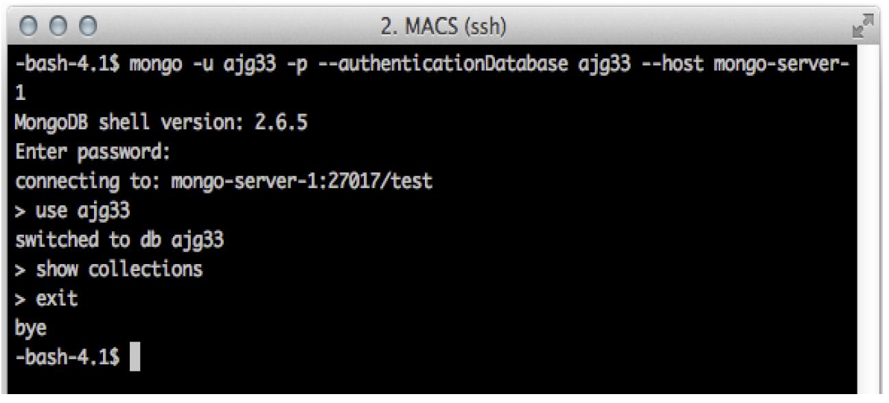
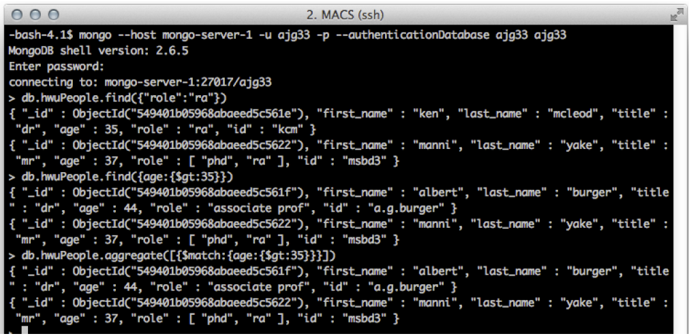
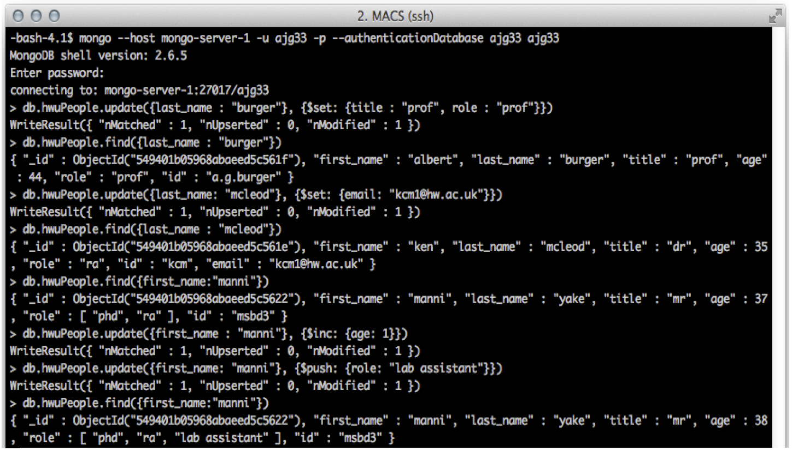
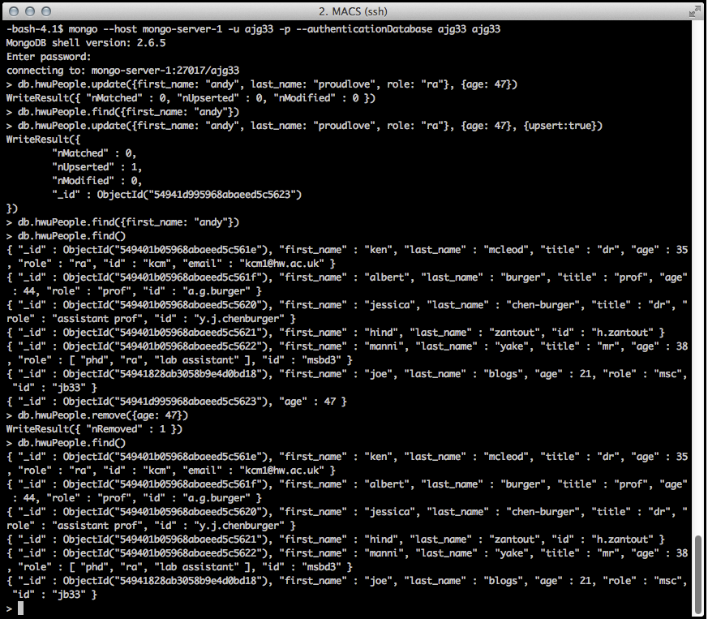
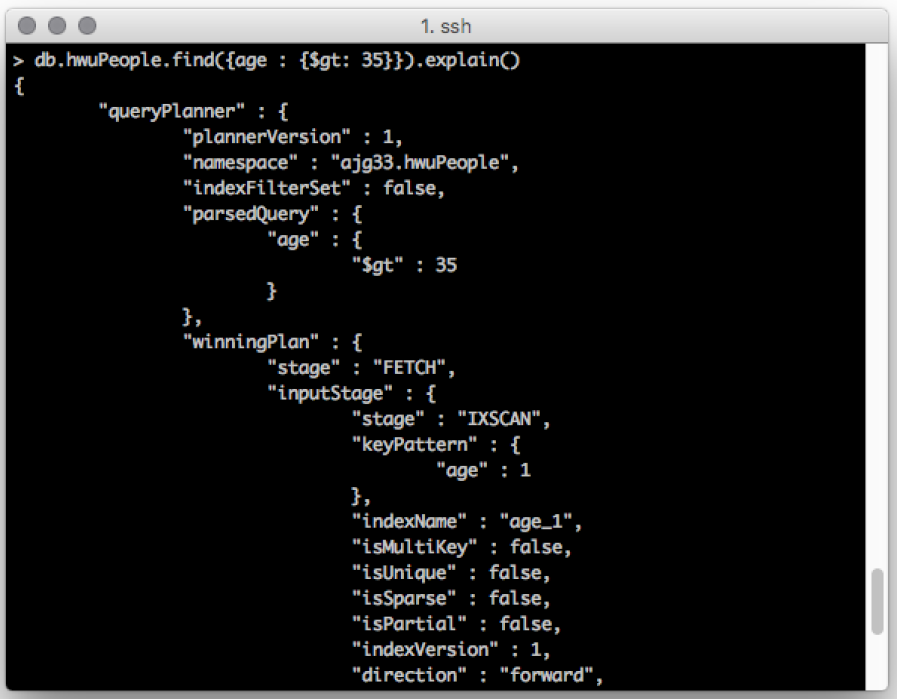
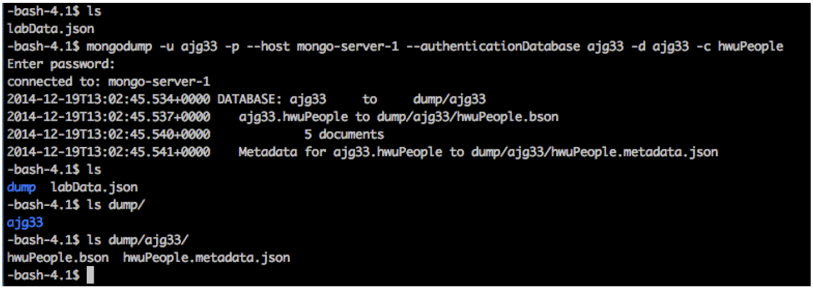

# MongoDB lab


## 1. INTRODUCTION


You should follow along with this tutorial by entering the commands into your personal database, and completing the exercises where prompted. Ask the lab helpers if you get stuck.

```
NOTE: Before you can start this lab, you must have a mongoDB account and database for you. This should have already been created for you by help. If not, please contact help@macs.hw.ac.uk to set this up.
Your personal database and username should be the same.
```

In this document commands are shown using fixed width font, and variables that you need to change in the commands are shown in angle brackets in italics `<variable>` (do not include the angle brackets in the command).

## 2. CONNECTING

Open a Linux terminal windowshow (in Edinburgh GRID lab use the Virtual Box virtual machine) 

Connect to mongoDB using the mongo client: 

```
mongo -u <username> -p --authenticationDatabase <username> --host mongo-server-1
```

|  |
|:--:|
|*Figure 1: Screenshot showing connection interaction*|

Enter your password at the prompt. Then type:
use `<username>`

You have opened the test database with your personal database. Look at the collections that currently exist 

(nothing should appear as your database is empty): 
```
show collections
```
To change your password (important for securing your work):
```
db.changeUserPassword(" <username> "," <password> ")
```
Now exit mongo and return to the terminal’s command line:
```
exit
```

## 3. IMPORTING DATA

Download the data file for this lab from: 
```
wget http://www.macs.hw.ac.uk/~pb56/labData.json
```
Open the file and look at the data.
```
less labData.json
```
Notice that there is one JSON document per line. `Press q to exit less.`

Using the Linux command line, insert the example data into your database using mongoimport (the file parameter below assumes you are in the directory containing the file and you have not renamed it):
```
mongoimport --db <username> -u <username> --host mongo-server- 1 --authenticationDatabase < username > --collection hwuPeople --file labData.json
```
Note that there is no `-p` parameter in the `mongoimport` command. Repeat the above steps (from `CONNECTING`) to logon and view the collections. When you look at the collections you should now see a `hwuPeople` collection. 

Inspect the contents of hwuPeople:
```
db.hwuPeople.find()
```
...also try this version with formatting:
```
db.hwuPeople.find().pretty()
```
You will see 5 people listed, as shown bellow Figure. 
|  |
|:--:|
|*Figure 2: Importing data*|

In each person you will see:
```
{ "_id" : ObjectId("541ff6239c494c635a2d32d7"), "first_name" ...
```
This `"_id"` is the internal identifier that is used to uniquely identify documents. It is the only part of the document that is indexed by default, i .e. it is the primary key.

## 4. QUERYING

Let us find all the people with role `“ra”`:
```
db.hwuPeople.find({role : "ra"})
```
Notice that Manni appears in the output: mongo automatically searches inside an array. To find all people named `“Ken McLeod”`:
```
db.hwuPeople.find({first_name: "ken" ,last_name: "mcleod"})
```
To find all people older than 35:
```
db.hwuPeople.find({age : {$gt: 35}})
```
There are multiple ways to write the same query, e.g.:
```
db.hwuPeople.aggregate([{ $match : { age : {$gt: 35}}}])
```
|  |
|:--:|
|*Figure 3: Basic queries*|

<a></a>

<h3 style="color: red !important" class="text-red mb-2">TASK : write a query to find all the RAs under 40 years old.</h3>
```
Hint: use $lt for less than.
```

You can choose which fields in a document are returned. To display only names: 
```
db.hwuPeople.find({},{first_name : 1, last_name : 1})
```
Note that the ObjectId is still displayed. To remove that you need:
```
db.hwuPeople.find({},{_id:0,first_name : 1, last_name : 1})
```
|  |
|:--:|
| *Figure 4: Choosing the columns to return* |

It is possible to search for strings within text fields – try this:
```
db.hwuPeople.find({$text: {$search: "burger"}})
```

The above query did not work as we have not set up a text index yet. To create an index on the first and last names we use the command:
```
db.hwuPeople.createIndex({first_name: "text",last_name: "text"})
```

Now we can run our search query to find all people who have the string "burger" in their name. 
Another way to find ‘contains’ is as follows (this should also work on non-indexed
fields):

```
db.hwuPeople.find({last_name:/burger/i})
```
**Note:** `the i makes it a case-insensitive search, remove the i to make it case-sensitive`

You can specify multiple conditions using AND logic to add more conditions to the query; alternatively you can specify OR to permit alternatives - for example find all people that have a role `“assistant prof”` or `“associate prof”`:
|  |
|:--:|
|*Figure 5: AND / OR conditions*|

```
db.hwuPeople.find({$or: [{role: 'associate prof'}, {role: 'assistant prof'}]})
```
To find everyone who does not have an `age` specified:
```
db.hwuPeople.find({age : {$exists: false}})
```

Rather than listing the documents without an age, we can simply ask for the number of documents using the count function: 
```
db.hwuPeople.count({age : {$exists: false}})
```
You could also do this as follows:
```
db.hwuPeople.find({age : {$exists: false}}).count()
```
To sort the results of a `find` query append `.sort({ name : 1})` after the find() statement. Use 1 for ascending order, and -1 for descending order.

<h3 style="color:red">TASK: Sort the entire list of people in ascending order by age.</h3>

## 5. INSERTING, UPDATING & REMOVING
To insert someone into the database:
```
db.hwuPeople.insert({first_name : "joe", last_name : "blogs", age : 21, role : "msc", id : "jb33"})
```
To prove this worked:
```
db.hwuPeople.find({first_name : "joe"})
```
|  |
|:--:|
|*Figure 6: Inserting data*|

<h3 style="color:red">TASK: add yourself, specifying your _id manually.</h3>
```
HINT: treat “_id” as just another name/value pair.
```

Dr Burger has been promoted and so we need to change his `title` and his `role` to `prof`:
```
db.hwuPeople.update({last_name : "burger"}, {$set: {title : "prof", role : "prof"}})
```

<h3 style="color:red">QUESTION: What are the potential side effects of the previous statement?</h3>
```
HINT: “burger” is a rare last name in the UK and this is a small dataset
```

With a flexible schema you can add information to one document but not to others: add an email address for Dr McLeod:
```
db.hwuPeople.update({last_name: "mcleod"}, {$set: {email: "kcm1@hw.ac.uk"}})
```
Look at the document for Manni:
```
db.hwuPeople.find({first_name : "manni"})
```
He is listed as being 37, but his birthday was last week; to increase his age: 
```
db.hwuPeople.update({first_name : "manni"}, {$inc: {age: 1}})
```
Manni has another role (lab assistant), to add this:
```
db.hwuPeople.update({first_name: "manni"}, {$push: {role: "lab assistant"}})
```
**NOTE: $push only works for arrays. **

<h3 style="color:red"> TASK: update your information to provide your email address and your title  (e.g., Mr, Ms etc.).</h3>

|  |
|:--:|
|*Figure 7: Updating existing entries*|

If you try to update a document that is not there, nothing happens:
```
db.hwuPeople.update({first_name: "andy", last_name: "proudlove", role: "ra"}, {age: 47})
```

```
db.hwuPeople.find({first_name: "andy"})
```
Andy has not been added. However, mongoDB supports “upserts” (update or insert if there is no document found):

```
db.hwuPeople.update({first_name: "andy", last_name: "proudlove", role: "ra"}, {age: 47}, {upsert:true})
```

```
db.hwuPeople.find({first_name: "andy"})
```

```
db.hwuPeople.find()
```
Notice what has happened: a new document has been added, but it only contains `age`. Clearly, this is wrong! To remove this document (assuming your age is not 47):

```
db.hwuPeople.remove({age: 47})
```
|  |
|:--:|
|*Figure 8: Upsert interaction*|
<h3 style="color:red"> TASK: Write an upsert query to properly insert Andy Proudlove into the database. </h3>

<h3 style="color:red"> TASK: Use the remove command to delete Joe Bloggs from the database. </h3>

```
HINT: most of the operations that work with the insert command also work with the remove command.
```

## 6. OPTIMISATION

For queries to be efficient they must use an index. To check if a query uses an index use the `.explain()` method:
```
db.hwuPeople.find({age : {$gt: 35}}).explain()
```
|  |
|:--:|
|*Figure 9: Explain query plan*|

We can see that the winning plan is `COLLSCAN` meaning that the collection is being scanned , `i.e. no index was used.`

To see more details of the number of documents scanned add `“executionStats”` as follows:
```
db.hwuPeople.find({age : {$gt: 35}}).explain("executionStats")
```

To add an index to `age`:
```
db.hwuPeople.createIndex({age: 1})
```

Now if we run the .explain() method again we see the winning plan is based on an `IXSCAN`, i.e. it is using the index on the age field that we just created.

Also try the `executionStats` to see how many documents were examined this time.
```
hwuPeople.find({age : {$gt: 35}}).explain("executionStats")
```
|  |
|:--:|
|*Figure 10: Explain plan after index creation*|

## 7. BACKUP
Exit mongo and use `mongoexport` to backup your current database:
```
mongodump -u <username> --host mongo-server- 1 --authenticationDatabase <username> -d <username> -c hwuPeople
```
Note that there is no `-p` parameter in the `mongodump` command.
In your current directory you should see a `dump` folder. Your files are in there.

|  |
|:--:|
|*Figure 11: Exporting a collection*|

You can copy them to another machine and use `mongoimport` to import them.

## 8. DELETING A COLLECTION

Log into mongo and switch to your database. 
To delete the hwuPeople collection:

```
db.hwuPeople.drop()
```

```
show collections
```
|  |
|:--:|
| *Figure 12: Dropping a collection* |
## 9. EXERCISE

**TASK:** 
```
Create a new collection (called “exercise”) that includes the following information:
name: albert burger, role: supervisor
name: alasdair gray, role: supervisor
name: iain wiles, role: phd
name: steve smith, role: phd
name: hugh dollar, role: phd

Additionally, include the following relationships:

Alasdair supervises Iain and Steve.

Albert supervises Steve and Hugh.
HINT: use an array to hold the supervisor information against each student.
```
<h3 style="color:red"> TASK: Now construct an optimized query to list all of Alasdair Gray’s students.</3>

<h3 style="color:red"> TASK: Write a query to find all the students with 2 supervisors.</h3>
```
HINT: use the condition $size: 2.
```

<h3 style="color:red"> TASK: Write a query to find those with more than 1 supervisor</h3>
```
HINT: use the condition $where and the javascript length feature.
```

## 10. FUN EXERCISE

### Try using Javascript to create 50 robots in a collection.

```
for (i=0;i<50;i++)
{
	db.robots.insert({name:"robot"+i } )
}
```

Count the documents in the collection to make sure it all went as planned.
```
db.robots.count()
```

...or you can take a look with:
```
db.robots.find()
```

```
Note: you will need to type “it” to iterate through the results
```

Now let’s add a unique index to the robot collection based on the name.
```
db.robots.createIndex({"name":1},{unique:true})
```
Try to run the JAVASCRIPT again to insert the same 50 robots... you should get an
error about duplicates.

To remove the robots from the collection use a blank search filter like this:

```
db.robots.deleteMany({})
```
To check they were deleted use count() or find ().
```
db.robots.count()
```

```
--- END OF THE LAB ---

```

```

```